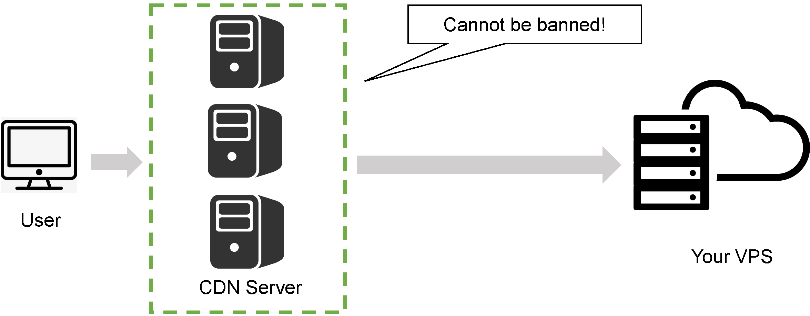
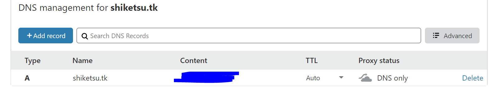

It is really an useful skill for people who live in China to setup a VPN. Considering the frequently ban of VPS on some protocols like Shadowsocks, I use the V2Ray. It has at least three advantages:
- **Security**: v2ray is a much more secure protocol than others.
- **Convenience**: there are many convenient scripts to configure v2ray
- **Effectiveness**: it cannot be banned when you use both v2ray and cdn. Otherwise, most other protocols can be banned and you need to find another one. It just wastes your money.

Welcome to the v2ray world! You can get a basic understanding from the following image.



- Target: setup a VPN for your own use.
- Cost: about $47 (330 RMB) per year and a bit of your rest time.
- Level: ⭐⭐⭐⭐

### 1. Buy a VPS

I choose the [](https://bwh88.net/) for the reason in **price** and **convenience** (support for Alipay), however, there are some other kinds of VPS server providers with appealling prices, such as 

| :------ |:--- | :--- |
| Vultr | [https://www.vultr.com/](https://www.vultr.com/)| esay to beginners |
| Linode | [https://www.linode.com/](https://www.linode.com/)| |

**Remember to use promotion code in BandwagonHOST!** It usually has a 6% discounting!

### 2. Powerful techniques (all are free!)
Against the banning of servers' IP in China, we choose another powerful technique to build our VPN server, rather the directly connecting by Shadowsocks protocol.

#### Register your free domain
I strongly recommend you to register a free domain in [](https://my.freenom.com/) because of its 12-month free domain service. However, you can register a new one when the date is out for our use. By the way, it is also okay to buy a domain in any other ways.

**Note:** You should create an account [here](http://www.freenom.com/en/developers.html).

#### Setup CDN for your domain

After registering the domain, we need to connect it with our VPS, i.e., the CDN service. Luckily, we can use the free service provided by [cloudflare.com](https://dash.cloudflare.com/). In its DNS dashboard, you shoud setup like following:



**Note:** You should gray the status button. It may take a long time, and you need to continue the next step after days. Please ensure that DNS have been updated in your network by checking the response of following command:
```bash
ping <your domain>
```
If the response IP is same to your VPS IP, congratuation!

#### Install V2ray service on your VPS

We need to install v2ray service in our VPS by following command:

```bash
bash <(curl –s –L https://git.io/v2ray.sh)
```
and then install step by step (this script may be unavaible, please find another one in [Github](https://github.com) if it happens).

- When the script ask you to install, type `1` and then `enter` to install.
- When the script ask you to choose protocol, type `4` and then `enter`.
- When the script ask you to choose a port, type any number from 1-65535 you like, except 80 or 443. Actually, they are used specific reasons.
- When the script ask you to input you damain, do it.
- Make sure that your DNS has been updated as the last step said.

### Reference
- [How to setup your shadowsocks server?](https://github.com/easonhuang123/blog/issues/1). When you configure your domain in [freenom.com](https://freenom.com), you may get into some troubles because that the register script needs recaptcha (it may hide in the website appreance). Since you do NOT EVEN have access to Goolgle, it becomes impossible. Therefore, I strongly recommend you to setup you shadowsocks server in you VPS first, and then get a free domain to setup you v2ray.